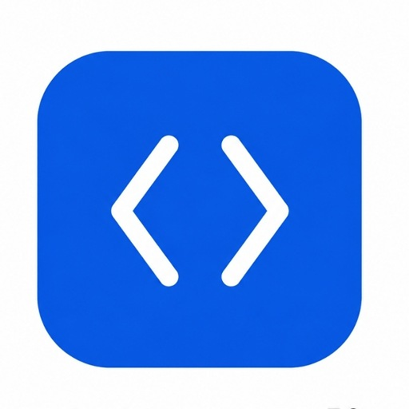

# htmlxeditor

  

  
  
  

### Suporte a linguagens

O HTMLxEditor oferece suporte a diferentes tecnologias utilizadas no desenvolvimento Web:

### Suporte a:

- HTML
- CSS
- JavaScript
- TypeScript
- JSX
- TSX

### Desenvolvimento

O HTMLxEditor permite desenvolver projetos diretamente pelo telemóvel, com recursos para:

- Criar e editar arquivos de código.
- Organizar arquivos e pastas do projeto.
- Executar o código diretamente no aplicativo.
- Visualizar o resultado através do Preview.
- Trabalhar com diferentes tecnologias no mesmo projeto.
- Desenvolver projetos individualmente ou em equipe.

### Colaboração

O HTMLxEditor permite criar áreas de trabalho compartilhadas para que duas ou mais pessoas possam trabalhar no mesmo projeto.

- Criar áreas de trabalho colaborativas.
- Adicionar outros participantes.
- Editar projetos em conjunto.
- Compartilhar arquivos entre os participantes.
- Trabalhar em equipe no mesmo ambiente.

### Repositórios

Os projetos podem ser organizados e versionados através do sistema de repositórios integrado ao HTMLxEditor.

- Conectar repositórios.
- Gerenciar projetos.
- Registrar alterações através de commits.
- Consultar o histórico de alterações.
- Trabalhar com diferentes versões do projeto.

### Publicação e Hospedagem de Sites

O HTMLxEditor também permite publicar projetos Web diretamente pelo aplicativo.

- Preparar o projeto para publicação.
- Hospedar o projeto.
- Publicar o site.
- Gerar um link público.
- Acessar o projeto diretamente através do navegador.

### Tudo em um só lugar

O HTMLxEditor reúne edição, execução, colaboração, versionamento e publicação em um único ambiente, permitindo que o desenvolvedor passe do **código para um projeto publicado sem sair do aplicativo**.

> **Uma IDE poderosa. Sempre no seu bolso.**